# DepthClockWallpaper Functional Flow Diagram

```mermaid
%%{init: {'theme': 'base', 'themeVariables': { 'primaryColor': '#1f2937', 'primaryTextColor': '#f9fafb', 'primaryBorderColor': '#4b5563', 'lineColor': '#6b7280', 'fillType0': '#374151', 'fillType1': '#1e40af', 'fillType2': '#166534', 'fillType3': '#92400e' } }}%%
graph TD
    %% Entry Point
    A[Program.Main] --> B[HotConfigManager.EnsureEmbeddedResources]
    A --> C[Global Exception Handler Setup]
    A --> D[SettingsForm Constructor]
    
    %% SettingsForm Initialization
    D --> E[HotWallpaperOrchestrator Constructor]
    D --> F[InitializeTrayIcon]
    D --> G[BingUpdateTimer.Start]
    D --> H[Task.Run orchestrator.LoadWallpaper]
    H --> I[Application.Run]
    
    %% HotWallpaperOrchestrator Initialization
    E --> J[HotConfigManager.Current]
    E --> K[Subscribe to ConfigChanged]
    E --> L[InitializeComponents]
    
    L --> M[DepthEngine Constructor]
    L --> N[Compositor Constructor]
    L --> O[ClockTimer Setup]
    
    %% Initial Wallpaper Load
    P[LoadWallpaper] --> Q[Determine Wallpaper Source]
    Q --> R[BingWallpaperService.Download] 
    Q --> S[Custom Path Load]
    R --> T[SKBitmap.Decode]
    S --> T
    T --> U[DepthEngine.ExtractForegroundMask]
    
    %% Depth Processing Pipeline
    U --> V[InferDepth - ONNX Session]
    V --> W[CalculateOptimalThreshold]
    W --> X[CreateForegroundMask]
    X --> Y[Apply Gaussian Blur]
    Y --> Z[Save Debug Images if Enabled]
    
    %% Periodic Clock Update Timer
    O --> AA[ClockTimer.Elapsed Event]
    AA --> BB[RenderCurrentFrame]
    
    %% Frame Rendering Pipeline
    BB --> CC[Get Current Time String]
    BB --> DD[Compositor.RenderFrame]
    DD --> EE[Draw Clock with Shadows]
    DD --> FF[Apply Depth Mask if Significant]
    DD --> GG[Save Frame to ActiveWallpaper]
    GG --> HH[WallpaperSetter.SetWallpaper]
    HH --> II[SystemParametersInfoW Unicode]
    II --> JJ[SystemParametersInfoW ANSI]
    JJ --> KK[Registry Modification]
    KK --> LL[PowerShell Refresh]
    LL --> MM[WorkerW Direct Manipulation]
    MM --> NN[FrameUpdated Event]
    
    %% Configuration Hot-Reload Flow
    OO[Config File Change] --> PP[HotConfigManager.UpdateConfig]
    PP --> QQ[Lock Config Thread-Safe]
    QQ --> RR[Apply User Changes]
    RR --> SS[SaveToFile JSON]
    SS --> TT[ConfigChanged Event]
    TT --> UU[HotWallpaperOrchestrator.OnConfigurationChanged]
    UU --> VV[ReinitializeComponents]
    
    %% Component Reinitialization on Config Change
    VV --> WW[DepthEngine.Dispose]
    WW --> XX[DepthEngine Recreate]
    VV --> YY[Compositor.Dispose]
    YY --> ZZ[Compositor Recreate]
    VV --> AAA[Reload Wallpaper]
    
    %% Bing Wallpaper Update Timer
    G --> BBB[BingUpdateTimer.Tick Event]
    BBB --> CCC[CheckForBingUpdates]
    CCC --> DDD[New Wallpaper Available?]
    DDD -->|Yes| EEE[Download New Bing Wallpaper]
    EEE --> FFF[Trigger LoadWallpaper]
    DDD -->|No| GGG[Skip Update]
    
    %% UI Events and Settings
    HHH[SettingsForm.TrayIcon Click] --> III[Show Settings Dialog]
    III --> JJJ[User Changes Settings]
    JJJ --> KKK[Apply Settings Click]
    KKK --> LLL[HotConfigManager.UpdateConfig]
    
    %% Disposal Patterns
    MMM[Application Shutdown] --> NNN[SettingsForm.Dispose]
    NNN --> OOO[HotWallpaperOrchestrator.Dispose]
    OOO --> PPP[ClockTimer.Dispose]
    OOO --> QQQ[BingUpdateTimer.Dispose]
    OOO --> RRR[DepthEngine.Dispose]
    OOO --> SSS[Compositor.Dispose]
    OOO --> TTT[BingWallpaperService.Dispose]
    NNN --> UUU[TrayIcon.Dispose]
    
    %% Styling for different component types
    classDef entryPoint fill:#1e40af,stroke:#3b82f6,color:#ffffff
    classDef timer fill:#166534,stroke:#22c55e,color:#ffffff
    classDef disposal fill:#92400e,stroke:#f59e0b,color:#ffffff
    classDef processing fill:#7c3aed,stroke:#a78bfa,color:#ffffff
    classDef event fill:#dc2626,stroke:#ef4444,color:#ffffff
    classDef config fill:#0891b2,stroke:#06b6d4,color:#ffffff
    
    %% Apply classes
    class A entryPoint
    class AA,BBB timer
    class MMM,NNN,OOO,PPP,QQQ,RRR,SSS,TTT,UUU disposal
    class V,W,X,Y,DD,EE,FF processing
    class TT,UU,NN event
    class B,J,K,OO,PP,QQ,RR,SS,LLL config
```



## Key Insights for Memory Leak Analysis

### 🔍 Entry Points & Initialization
- **Program.Main** is the single entry point creating **SettingsForm**
- **HotWallpaperOrchestrator** is created once and manages the entire lifecycle
- All major components implement **IDisposable** properly

### ⚡ Event Subscription Patterns
- **ConfigChanged** event subscription in **HotWallpaperOrchestrator** constructor
- **FrameUpdated** event fired after each successful wallpaper update
- Timer events (**ClockTimer.Elapsed**, **BingUpdateTimer.Tick**) drive periodic updates

### 🔄 Periodic Updates
1. **ClockTimer** (configurable, default 60s) → **RenderCurrentFrame**
2. **BingUpdateTimer** (1 hour) → **CheckForBingUpdates**
3. **Config changes** → **ReinitializeComponents** (full recreation)

### 🗑️ Disposal Chain
The disposal follows a clear hierarchy:
```
SettingsForm.Dispose()
└── HotWallpaperOrchestrator.Dispose()
    ├── ClockTimer.Dispose()
    ├── BingUpdateTimer.Dispose()
    ├── DepthEngine.Dispose() (ONNX InferenceSession)
    ├── Compositor.Dispose() (SkiaSharp Typeface)
    └── BingWallpaperService.Dispose() (HttpClient)
```

### 🚨 Potential Memory Leak Points
1. **Event Unsubscription**: Ensure ConfigChanged event is unsubscribed on disposal
2. **Timer Cleanup**: Both timers must be disposed to prevent further callbacks
3. **ONNX Resources**: InferenceSession must be properly disposed
4. **SkiaSharp Resources**: Typefaces and bitmaps need explicit disposal
5. **File Handles**: Temporary files and embedded resources

### ✅ Proper Disposal Pattern
The codebase follows the recommended pattern:
- Each component that owns disposable resources implements **IDisposable**
- Parent components dispose their children in reverse creation order
- Timers are stopped and disposed to prevent further callbacks
- Event subscriptions are cleaned up during disposal

This architecture shows a well-designed disposal pattern with clear ownership hierarchy and proper cleanup mechanisms.
