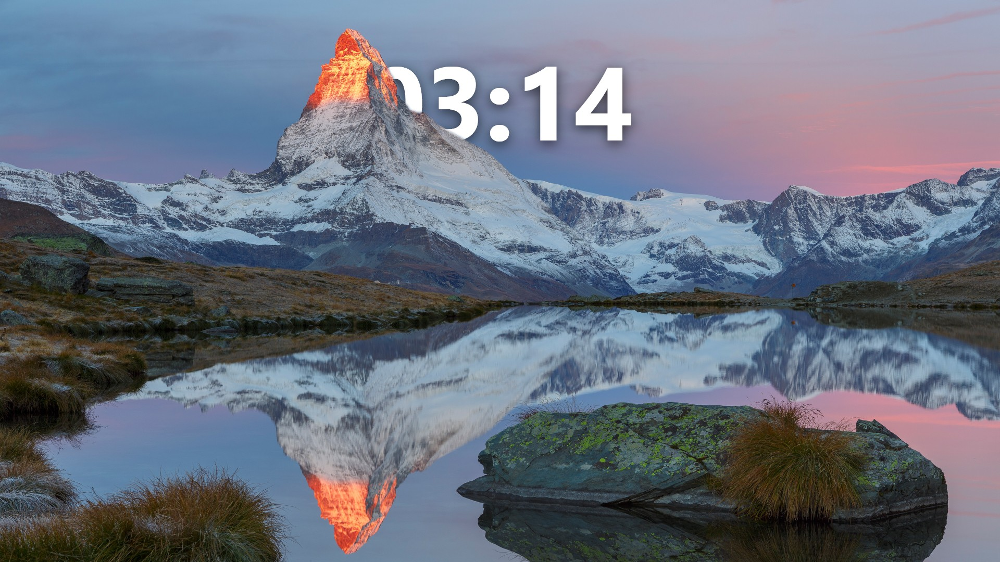
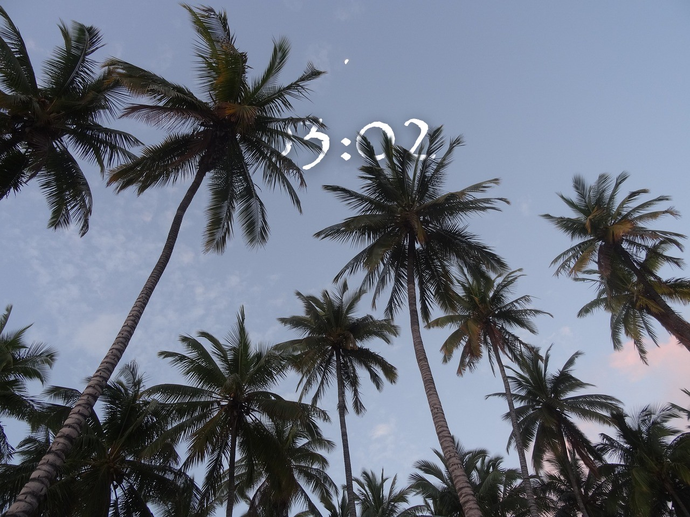

# DepthClockWallpaper

A Windows desktop application that places your live clock within the three-dimensional depth of your wallpaper. Using AI-powered depth estimation, the app creates a stunning atmospheric effect where the clock appears to exist *behind* foreground objects while remaining visible in the background.

> **Vibe Coded Project**: The code is rather chaotic, sorry about that. You can blame 'Big Pickle' and partially 'MiniMax M2.1 Free' model for that. I just wanted to practice agentic coding using OpenCode 😁. Though after a while I switched to Opus 4.5 and Sonnet 4.5 which were much better at cleaning up the codebase and fixing a lot of things.


## Examples





## Features

- **Depth-Aware Clock Placement**: The clock renders behind closer objects for a natural 3D effect
- **AI-Powered Depth Estimation**: Using Depth-Anything-V2 model
- **Real-Time Updates**: Live clock that updates every minute (configurable)
- **Customizable Clock**: Fonts, colors, shadows, position, and time format
- **Daily Bing Wallpapers**: Automatically fetches beautiful Bing homepage images
- **System Tray Operation**: Runs quietly in the background with minimal footprint
- **Auto Clock Positioning**: Automatically positions the clock to achieve your desired level of hiding behind foreground objects

## How It Works

DepthClockWallpaper uses a depth estimation model Depth-Anything-V2 to split a given image into 2 layers (foreground and background objects). It places an image with clock in between those 2 layers. Saves the layered image in your Temp folder and updates your wallpaper. The frequency of updates and the threshold to determine the depth can be configured per your taste.

## Installation

1. **Setup**
   - Download the latest release
   - Extract the ZIP file to your desired location
   - Run `DepthClockWallpaper.exe`


2. **First Launch**
   - The app will appear in your system tray (bottom-right corner)
   - Right-click the tray icon to access settings
   - Configure your preferences and the app will set your wallpaper
   - It sets the app to always launch on startup (you can disable that in the settings)

## Usage

### System Tray

Right-click the DepthClockWallpaper icon in your system tray to access:
- **Settings**: Open the configuration dialog
- **Exit**: Close the application

### Settings

- **Wallpaper Mode**: Choose between custom images or daily Bing wallpapers
- **Clock Style**: Customize font, color, size, shadows, and position
- **Position Mode**:
  - **Auto Position Mode**: Automatically finds optimal clock position based on depth analysis
  - **Target Coverage**: Sets how much of the clock you want hidden behind foreground objects (0% = fully visible, 50% = half hidden, 100% = maximally hidden)
- **Depth Settings**: Adjust foreground detection threshold and mask blur
- **Performance**: Toggle GPU acceleration and configure update intervals

## For Developers

1. **Prerequisites**
   - .NET 8.0
   - IDE of your choice: Visual Studio / Rider
   - Python (needed to build your onnx model file using `./Python/export_model.py`)
   - uv (for environment and package management)

### Folder Structure

```
DepthClockWallpaper/
├── Core/                              # Core business logic
│   ├── Orchestrator.cs                # Main coordinator with timer and cache logic
│   ├── DepthEngine.cs                 # AI depth estimation using ONNX model
│   ├── Compositor.cs                  # Composites clock onto wallpaper with depth masking
│   ├── CacheManager.cs                # Depth mask caching for performance
│   ├── WallpaperSetter.cs             # Windows wallpaper setting (multiple methods)
│   ├── BingWallpaperService.cs        # Fetches daily Bing homepage images
│   ├── CrashLogger.cs                 # Centralized crash logging
│   └── Win32.cs                       # Win32 API interop
├── Models/                            # Data models
│   ├── Config.cs                      # Configuration classes (AppConfig, ClockConfig, etc.)
│   ├── WallpaperPaths.cs              # Centralized temp file paths
│   └── WritableJsonOptions.cs         # Hot-reload config writer
├── UI/                                # Windows Forms UI
│   └── SettingsForm.cs                # Settings dialog with system tray
├── Python/                            # Model export utilities
│   ├── export_model.py                # Exports Depth-Anything-V2 to ONNX format
│   └── pyproject.toml                 # Python dependencies (uv)
├── Scripts/                           # PowerShell scripts
│   ├── run.ps1                        # Quick start script (build + run)
│   ├── compile.ps1                    # Full build/publish script
│   └── install_depth_anything.ps1     # Model repository setup
├── depth_anything_v2_small.onnx       # AI model (ONNX format)
├── depth_anything_v2_small.onnx.data  # AI model weights
├── DepthClockWallpaper.csproj         # .NET 8 project file
├── DepthClockWallpaper.sln            # Solution file
├── Program.cs                         # Entry point with DI setup
└── icon.ico                           # Application icon
```

### Tech Stack

- **Runtime**: .NET 8.0-windows
- **UI Framework**: Windows Forms
- **AI/ML**: Microsoft.ML.OnnxRuntime.DirectML 1.23.0
- **Graphics**: SkiaSharp 3.119.1
- **DI/Config**: Microsoft.Extensions.Hosting 10.0.2
- **Model**: Depth-Anything-V2 Small (ViT-S encoder, 24.8M parameters)

### Building from Source

```powershell
# Clone the repository
git clone https://github.com/nfzv/DepthClockWallpaper.git
cd DepthClockWallpaper

# Quick start (builds model if needed, then builds and runs)
.\Scripts\run.ps1

# Or build manually (requires ONNX model to exist)
dotnet build -c Release
dotnet run -c Release
```

**Note:** The `run.ps1` script will automatically:
1. Check for the ONNX model and export it if missing (requires [uv](https://docs.astral.sh/uv/) and Python)
2. Build the project
3. Run the application

For manual model export, see `Python/export_model.py`.

## Troubleshooting

### Debug Mode
Enable debug mode to save intermediate images for troubleshooting:
1. In Settings, enable "Enable Debug Mode"
2. Set a debug path (e.g., `debug/`)
3. Check the output images:
   - `0_depth_map.png`: Raw depth estimation output
   - `4_raw_mask.png`: Binary foreground mask before blur
   - `4a_blurred_mask.png`: Softened mask with blur applied

### Controlling Clock Visibility
To adjust how much of the clock is hidden behind foreground objects:

1. **Enable Auto Position Mode**: The clock will automatically position itself based on your target coverage
2. **Adjust Target Coverage**: 
   - Lower values (0-30%) keep the clock mostly visible
   - Medium values (40-60%) create a balanced semi-hidden effect
   - Higher values (70-100%) maximize the clock hiding behind objects
3. **Adjust Threshold Percentile**: A lower value makes the mask more selective (fewer objects considered "foreground")

## FAQ

**Q: Does DepthClockWallpaper support dual monitors?**
A: Currently, the app sets the same wallpaper across all monitors. Multi-monitor support with per-monitor clock positioning is a potential improvement.

**Q: Can I use my own wallpapers instead of Bing images?**
A: Yes. In settings, switch to "Custom" mode and select your preferred image path.

**Q: Does this work with animated wallpapers?**
A: No, DepthClockWallpaper currently only supports static images. Animated wallpaper support is not planned but could be explored as a future enhancement. Depth-Anything-V2 does support video processing, though it's still theoretical. 

**Q: How do I control how much of the clock is hidden?**
A: Use the "Target Coverage" slider in Auto Position Mode:
- Set to 0% for a fully visible clock
- Set to 50% for a balanced semi-hidden effect
- Set to 100% to maximize hiding behind foreground objects
You can also adjust the Threshold Percentile to control which objects are considered "foreground"

## License

MIT License